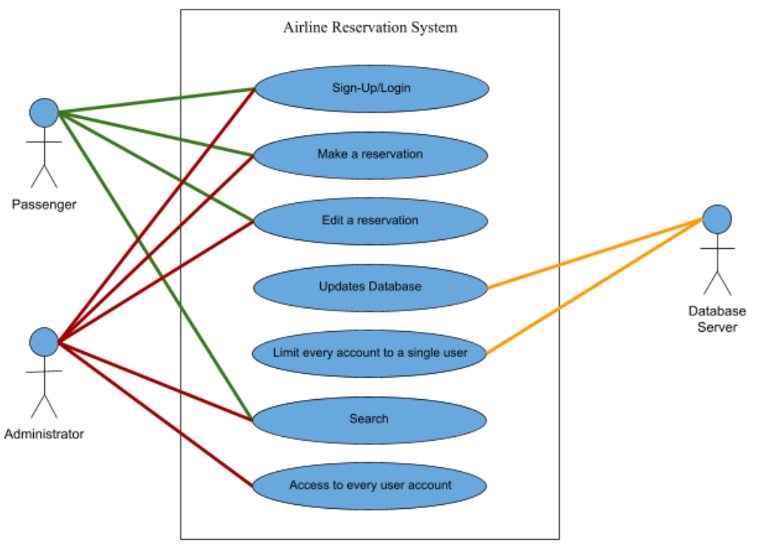
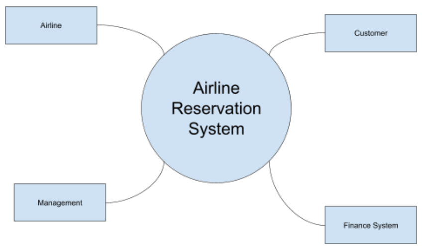
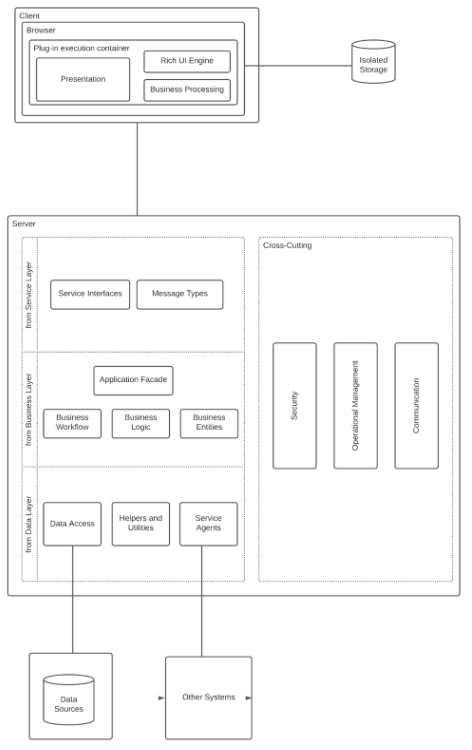
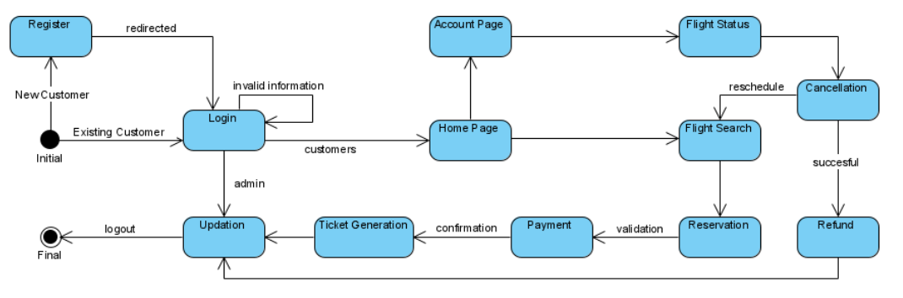
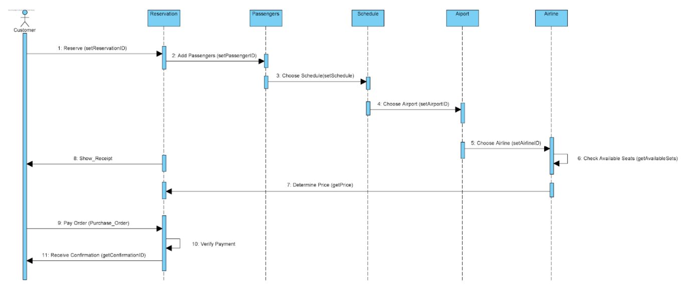
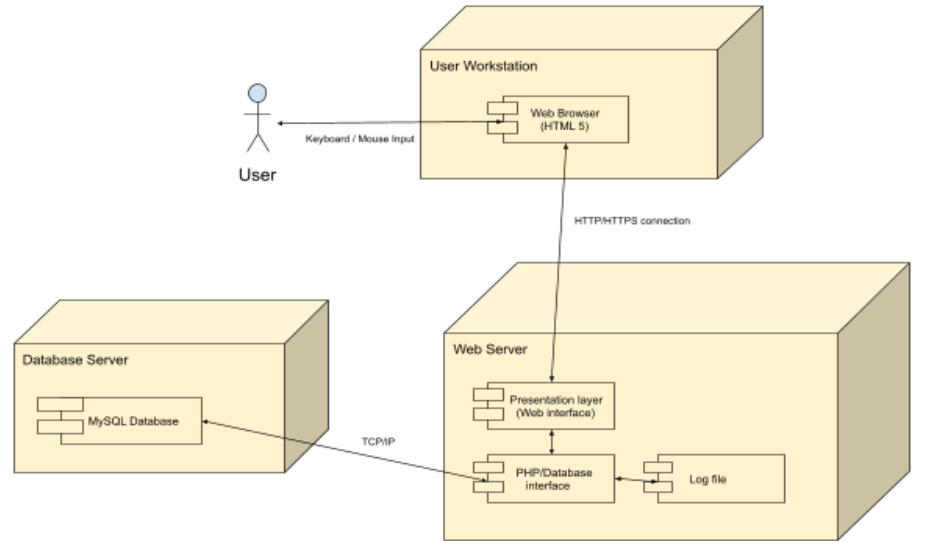
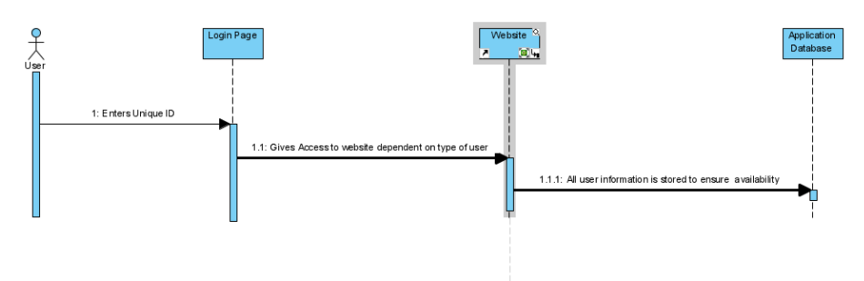

# casestudy-AirlineReservation

## Table of Contents
1) [System Requirements](#systemrequirments)
    * [Use Case](#sr-usecase)
    * [Quality Attributes](#sr-qualattr)
    * [System Constraints](#sr-sysconst)
    * [Architectural Concerns](#sr-archconc)

2) [Iteration 1 - Establishing an Overall System Structure](#iteration1)
    * [Step 2 - Establish Iteration Goals by Selecting Drivers](#i1-step2)
    * [Step 3 - Choose One or More Elements of the System to Refine](#i1-step3)
    * [Step 4 - Choose One or More Design Concepts That Satisfy the Selected Drivers](#i1-step4)
    * [Step 5 - Instantiate Architectural Elements, Allocate Responsibilities](#i1-step5)
    * [Step 6 - Sketch Views and Review Design Decisions](#i1-step6)
    * [Step 7 - Perform Analysis of Current Design and Review Iteration](#i1-step7)

3) [Iteration 2 - Identifying Structures to Support Primary Functionality](#iteration2)
    * [Step 2 - Establish Iteration Goals by Selecting Drivers](#i2-step2)
    * [Step 3 - Choose One or More Elements of the System to Refine](#i2-step3)
    * [Step 4 - Choose One or More Design Concepts That Satisfy the Selected Drivers](#i2-step4)
    * [Step 5 - Instantiate Architectural Elements, Allocate Responsibilities](#i2-step5)
    * [Step 6 - Sketch Views and Review Design Decisions](#i2-step6)
    * [Step 7 - Perform Analysis of Current Design and Review Iteration](#i2-step7)

4) [Iteration 3 - Addressing Quality Attribute Scenario Driver](#iteration3)
    * [Step 2 - Establish Iteration Goals by Selecting Drivers](#i3-step2)
    * [Step 3 - Choose One or More Elements of the System to Refine](#i3-step3)
    * [Step 4 - Choose One or More Design Concepts That Satisfy the Selected Drivers](#i3-step4)
    * [Step 5 - Instantiate Architectural Elements, Allocate Responsibilities](#i3-step5)
    * [Step 6 - Sketch Views and Review Design Decisions](#i3-step6)
    * [Step 7 - Perform Analysis of Current Design and Review Iteration](#i3-step7)

<!-- ---------------------------------------REVIEW INPUTS--------------------------------------- -->

## System Requirements
<!-- ---------------------------------------REVIEW INPUTS--------------------------------------- -->

  <!-- USE CASE -->

Figure 0.1: Use Case Diagram for Airline Reservation System

 
<table align="center">
    <tr>
        <th>Use Case</th>
        <th>Description</th>
    </tr>
    <tr>
        <td>UC-1: Sign-Up / Login</td>
        <td>A user or administrator registers/logs into the system through the sign-up/login screen.</td>
    </tr>
    <tr>
        <td>UC-2: Make a reservation</td>
        <td>A user makes a flight reservation, selecting the times, dates, passenger seats, travel class, destination and type of flight ticket.</td>
    </tr>
    <tr>
        <td>UC-3: Edit a reservation</td>
        <td>A user edits a reservation under their account. An admin edits a user's reservation.</td>
    </tr>
    <tr>
        <td>UC-4: Updates database</td>
        <td>Airline server updates the database for every user activity and every information that is entered.</td>
    </tr>
    <tr>
        <td>UC-5: Limit every account to a single user</td>
        <td>Airline server limits the user from registering the same email.</td>
    </tr>
    <tr>
        <td>UC-6: Search</td>
        <td>A user or admin uses the search bar with a filter to search for destinations or airlines.</td>
    </tr>
    <tr>
        <td>UC-7: Access to every user account</td>
        <td>An admin opens a user's account.</td>
    </tr>
</table>

Table 0.1: Use Cases

 

 <!-- QUALITY ATTRIBUTES -->
<table align="center"> 
    <tr>
        <th>ID</th>
        <th>Quality Attribute</th>
        <th>Scenario</th>
        <th>Associated Use Case</th>
    </tr>
    <tr>
        <td>QA-1</td>
        <td>Accessibility</td>
        <td>The website is user-friendly and accessible. The UI allows any user to navigate the website easily and quickly make reservations.</td>
        <td>UC-1, UC-3, UC-4, UC-6 & UC-7</td>
    </tr>
    <tr>
        <td>QA-2</td>
        <td>Security</td>
        <td>User logs into the system and makes changes to their account. The system has all changes documented, timed and also displays to the user.</td>
        <td>UC-5</td>
    </tr>
    <tr>
        <td>QA-3</td>
        <td>Compatibility</td>
        <td>User decides to use an Android device to make flight reservations and it is still functional as it is compatible with the device.</td>
        <td>ALL</td>
    </tr>
    <tr>
        <td>QA-4</td>
        <td>Availability</td>
        <td>There is downtime in the regular operation of the system. The system is backed up and running in less than a minute.</td>
        <td>ALL</td>
    </tr>
    <tr>
        <td>QA-5</td>
        <td>Performance</td>
        <td>All services are 100% functional at all times.</td>
        <td>ALL</td>
    </tr>
</table>

Table 0.2: Quality Attributes

 

 <!-- SYSTEM CONSTRAINTS -->
<table align="center">
    <tr>
        <th>ID</th>
        <th>Constraint</th>
    </tr>
    <tr>
        <td>CON-1</td>    
        <td>Accommodate for multiple users must be able to book a reservation / use the system simultaneously, automatically storing each sessions in the database</td>    
    </tr>
    <tr>
        <td>CON-2</td>    
        <td>Compatibility with desktop operating system (Windows, MacOS, Linux)</td>    
    </tr>
    <tr>
        <td>CON-3</td>    
        <td>Future support for mobile operating system (iOS, Android)</td>    
    </tr>
    <tr>
        <td>CON-4</td>    
        <td>System must respond quickly to request of information from database / servers. (transitions between forms, filtering of available flights, etc.)</td>    
    </tr>
    <tr>
        <td>CON-5</td>    
        <td>Network connections between user and servers should be consistent and reliable</td>    
    </tr>
    <tr>
        <td>CON-6</td>    
        <td>System must always be up to date with flight details (available flights, # of available seats, time of arrival/departure, etc.)</td>    
    </tr>
</table>

Table 0.3: System Constraints

 

 <!-- ARCHITECTURAL CONCERNS -->
<table align="center">
    <tr>
        <th>ID</th>
        <th>Concern</th>
    </tr>
    <tr>
        <td>CRN-1</td>
        <td>Establishing an overall system structure.</td>
    </tr>
    <tr>
        <td>CRN-2</td>
        <td>Leverage the team's knowledge about JavaScript Frameworks and Databases.</td>
    </tr>
    <tr>
        <td>CRN-3</td>
        <td>Allocate work to members of the development team.</td>
    </tr>
</table>

Table 0.4: Architectural Concerns

 

<!-- ---------------------------------------ITERATION 1--------------------------------------- -->

## Iteration 1 - Establishing an Overall System Structure
<!-- ---------------------------------------ITERATION 1--------------------------------------- -->
This section presents the results of the activities that are performed in each of the
steps of ADD in the first iteration of the design process. 

 <!-- Iteration 1 - Step 2 -->

### Step 2 : Establish Iteration Goals by Selecting Drivers

This iteration will mainly focus on the architectural concern about the compatibility of the system between each platform. A suitable reference architecture is needed to satisfy the system requirements. The drivers for this iteration will be:
* UC-4: Updates database  
* CON-2: Compatibility with desktop operating system (Windows, MacOS, Linux)
* CON-3: Future support for mobile operating system (iOS, Android)

Elements to decompose: 

Figure 1.1: Context Diagram for Airline Reservation System

  

 <!-- Iteration 1 - Step 3 -->

### Step 3: Choose One or More Elements of the System to Refine

The element to refine is the entire airline system (see Figure 1.1). The refinement is performed through decomposition. 
  

 <!-- Iteration 1 - Step 4 -->

### Step 4: Choose One or More Design Concepts That Satisfy the Selected Drivers
<table align="center">
    <tr>
        <th>Design Decisions and Location</th>
        <th>Rationale</th>
    </tr>
    <tr>
        <td>Logically structure the client/server part of the system using the Rich Internet Application reference architecture</td>
        <td>The web applications reference architecture communicates with a server using the HTTP protocol. This architecture is oriented toward the development of applications that are accessed from a web browser which the Airline Reservation System is intended to be. It provides clients / customers to easily access the Airline Reservation to book available flights.</td>
    </tr>
    <tr>
        <td>Physically structure the application using the three-tier deployment pattern</td>
        <td>A three-tier deployment pattern is most common when using web applications.</td>
    </tr>
</table>

Table 1.1: Design Decisions to Satisfy Selected Driver

 

 <!-- Iteration 1 - Step 5 -->

### Step 5: Instantiate Architectural Elements, Allocate Responsibilities
<table align="center">
    <tr>
        <th>Design Decisions and Location</th>
        <th>Rationale</th>
    </tr>
    <tr>
        <td>Add Data Sources</td>
        <td>Need to store data locally for later use.</td>
    </tr>
    <tr>
        <td>Presentation</td>
        <td>Responsible for managing user interaction</td>
    </tr>
    <tr>
        <td>Rich UI Engine</td>
        <td>Responsible for rendering user interface elements inside the plug-in execution container</td>
    </tr>
    <tr>
        <td>Business processing</td>
        <td>Responsible for managing business logic on the client side</td>
    </tr>
    <tr>
        <td>Service interfaces</td>
        <td>Responsible for exposing services that are consumed by the components that run in the browser</td>
    </tr>
    <tr>
        <td>Message types</td>
        <td>Responsible for managing the types of messages that are exchanged between the client part and the server part of the application.</td>
    </tr>
</table>

Table 1.2: Design Decisions to Instantiate Elements and Allocate Responsibilities 

 

 <!-- Iteration 1 - Step 6 -->

### Step 6: Sketch Views and Review Design Decisions

Figure 1.2: Context Diagram for Airline Reservation System

 

 <!-- Iteration 1 - Step 7 -->

### Step 7: Perform Analysis of Current Design and Review Iteration
<table align="center">
    <tr>
        <th align="center">Not Addressed</th>
        <th align="center">Partially Addressed</th>
        <th align="center">Completely Addressed</th>
        <th>Design Decisions Made During the Iteration</th>
    </tr>
    <tr>
        <td align="center"></td>
        <td align="center">UC-4</td>
        <td align="center"></td>
        <td>The selected reference architecture (Rich Internet Application) established the modules that will support this functionality.</td>
    </tr>
    <tr>
        <td align="center"></td>
        <td align="center">QA-3</td>
        <td align="center"></td>
        <td>The selected reference architecture will allow access and be compatible with Windows, MacOS, Linux, iOS, Android, etc. providing they have access to supporting web browsers.</td>
    </tr>
    <tr>
        <td align="center"></td>
        <td align="center"></td>
        <td align="center">CON-2</td>
        <td rowspan="2">Uses Rich Internet Application. This architecture is a web application designed compatible with desktop applications. It runs in a web browser and does not require software installation on the client side meaning it will have no trouble running on mobile devices (iOS & Android).</td>
    </tr>
    <tr>
        <td align="center"></td>
        <td align="center"></td>
        <td align="center">CON-3</td>
        <td></td>
    </tr>
    <tr>
        <td align="center"></td>
        <td align="center">CRN-2</td>
        <td align="center"></td>
        <td rowspan="2">Technologies considered take into account the knowledge of the developers and how comfortable they are with said technologies.</td>
    </tr>
    <tr>
        <td align="center"></td>
        <td align="center">CRN-3</td>
        <td align="center"></td>
        <td></td>
    </tr>
</table>

Table 1.3: Analysis of Current Design and Review Iteration

 

<!-- ---------------------------------------ITERATION 2--------------------------------------- -->

## Iteration 2 - Identifying Structures to Support Primary Functionality
<!-- ---------------------------------------ITERATION 2--------------------------------------- -->
This section presents the results of the activities that are performed in each of the
steps of ADD in the second iteration of the design process. 

### Step 2 : Establish Iteration Goals by Selecting Drivers

This iteration will mainly focus on the overall structure of our system. This being how the website will look and function. The drivers for this iteration will be:
* UC-1: Sign-Up / Login
* UC-2: Make a reservation
* UC-3: Edit a reservation
* UC-6: Search
* CRN-1: Establishing an overall system structure.
  

### Step 3: Choose One or More Elements of the System to Refine

The elements that will be refined in this iteration would be the use cases but mainly, UC-1, UC-2 and UC-6. Refining these elements will help support the functionality of the system and also address CRN-1.
  

### Step 4: Choose One or More Design Concepts That Satisfy the Selected Drivers
<table align="center">
    <tr>
        <th>Design Decisions and Location</th>
        <th>Rationale and Assumptions</th>
    </tr>
    <tr>
        <td>Build the user interface of the application using HTML, CSS and the React JavaScript framework.</td>
        <td>The react framework for building Web Applications ensures usability and functionality. The framework gives the website more structure, a rich user experience and leverages the team’s knowledge of the React framework. </td>
    </tr>
</table>

Table 2.1: Design Decisions to Satisfy Selected Driver

 

### Step 5: Instantiate Architectural Elements, Allocate Responsibilities
<table align="center">
    <tr>
        <th>Design Decisions and Location</th>
        <th>Rationale</th>
    </tr>
    <tr>
        <td>Map the system use cases to domain objects </td>
        <td>An initial identification of domain objects can be made by analyzing the system's use cases. Mapping the system will help and address CRN-1, which was to have an overall structure of our system.</td>
    </tr>
</table>

Table 2.2: Instantiate Elements & Allocate Responsibilities

 

### Step 6: Sketch Views and Review Design Decisions

Figure 2.1: Activity Diagram for Airline Reservation System

 

Figure 2.2: Sequence diagram for use case UC-2

 
<table align="center">
    <tr>
        <th>Method Name</th>  
        <th>Description</th>  
    </tr>
    <tr align="center">
        <td colspan="2"><b>Element:</b> Customer</td>
    </tr>
    <tr>
        <td>1: Reserve (setReservationID)</td>
        <td>Initialize reservation with the specified customer</td>
    </tr>
    <tr>
        <td>8: Show_Receipt</td>
        <td>Shows all flight details (total price, destination, etc.)</td>
    </tr>
    <tr>
        <td>9: Pay Order (Pruchase_Order)</td>
        <td>Prompts user for payment method to be filled out</td>
    </tr>
    <tr>
        <td>11: Receive Confirmation (getConfirmationID)</td>
        <td>Finalize flight order with confirmation</td>
    </tr>
    <tr align="center">
        <td colspan="2"><b>Element:</b> Reservation</td>
    </tr>
    <tr>
        <td>2: Add Passengers (setPassangerID)</td>
        <td>Add customer details to the following steps</td>
    </tr>
    <tr>
        <td>10: Verify Payment</td>
        <td>Verify payment from step (9)</td>
    </tr>
    <tr align="center">
        <td colspan="2"><b>Element:</b> Passengers</td>
    </tr>
    <tr>
        <td>3: Choose Schedule(setSchedule)</td>
        <td>Allows passenger to select flight schedule (time of arrival/departure)</td>
    </tr>
    <tr align="center">
        <td colspan="2"><b>Element:</b> Schedule</td>
    </tr>
    <tr>
        <td>4: Choose Airport(setAirportID)</td>
        <td>Lets passenger choose departure location (airport)</td>
    </tr>
    <tr align="center">
        <td colspan="2"><b>Element:</b> Airport</td>
    </tr>
    <tr>
        <td>5: Choose Airline(setAirlineID)</td>
        <td>Lets passenger choose which airline to travel in</td>
    </tr>
    <tr align="center">
        <td colspan="2"><b>Element:</b> Airline</td>
    </tr>
    <tr>
        <td>6: Check_Available Seats(getAvailableSets)</td>
        <td>Check the available seats in the selected airline</td>
    </tr>
    <tr>
        <td>7: Determine Price(getPrice)</td>
        <td>Determine the total of the specified flight</td>
    </tr>
</table>

Table 2.3: Method Description for UC-2 Sequence diagram

 

### Step 7: Perform Analysis of Current Design and Review Iteration
<table align="center">
    <tr>
        <th align="center">Not Addressed</th>
        <th align="center">Partially Addressed</th>
        <th align="center">Completely Addressed</th>
        <th>Design Decisions Made During the Iteration</th>
    </tr>
    <tr>
        <td align="center"></td>
        <td align="center"></td>
        <td align="center">UC-1</td>
        <td rowspan="4">Modules across the layers and preliminary interfaces to support this use case have been identified. Developers have an idea of the structure of the system due to the activity and sequence diagram which will aid in the construction of the website.</td>
    </tr>
    <tr>
        <td align="center"></td>
        <td align="center"></td>
        <td align="center">UC-2</td>
        <td></td>
    </tr>
    <tr>
        <td align="center"></td>
        <td align="center"></td>
        <td align="center">UC-3</td>
        <td></td>
    </tr>
    <tr>
        <td align="center"></td>
        <td align="center"></td>
        <td align="center">UC-6</td>
        <td></td>
    </tr>
    <tr>
        <td align="center"></td>
        <td align="center"></td>
        <td align="center">QA-1</td>
        <td>The elements that are associated with the use case (UC-2, 3, 6) have been identified. </td>
    </tr>
    <tr>
        <td align="center"></td>
        <td align="center"></td>
        <td align="center">QA-2</td>
        <td>The elements that are associated with the use case (UC-1) have been identified. </td>
    </tr>
    <tr>
        <td align="center"></td>
        <td align="center"></td>
        <td align="center">CRN-1</td>
        <td>Modules associated with all of the use cases have been identified. Structure of the system has been defined from the diagrams (activity & sequence).</td>
    </tr>
    <tr>
        <td align="center"></td>
        <td align="center">CRN-2</td>
        <td align="center"></td>
        <td>Technologies considered take into account the knowledge of the developers and how comfortable they are with said technologies.</td>
    </tr>
</table>

Table 2.4: Analysis of Current Design and Review Iteration

 

<!-- ---------------------------------------ITERATION 3--------------------------------------- -->

## Iteration 3 - Addressing Quality Attribute Scenario Driver
<!-- ---------------------------------------ITERATION 3--------------------------------------- -->
This section presents the results of the activities that are performed in each of the
steps of ADD in the third iteration of the design process. 

### Step 2 : Establish Iteration Goals by Selecting Drivers

For this iteration the main focus will be on QA-4: Availability and QA-5: Performance. The selected drivers are:
* UC-7: An admin open’s a user’s account
* UC-5: Limit every account to a single user
* UC-4: Updates Database
  

### Step 3: Choose One or More Elements of the System to Refine
For this step, the elements to be refined are UC-7, UC-5 and UC-4 from iteration 1. This will address QA-4: Availability and QA-5: Performance.
  

### Step 4: Choose One or More Design Concepts That Satisfy the Selected Drivers
<table align="center">
    <tr>
        <th>Design Decision and Location</th>
        <th>Rationale and Assumption</th>
    </tr>
    <tr>
        <td>Using PHP and MySQL for the Database.</td>
        <td>
            Refining the Database, ensures that every user has a unique ID (including the admin) and records user activities such as flight bookings under their account. The unique ID will differentiate certain users (such as the admin) from other users, who will have more user actions available to them (such as being able to access every client’s account). 
            
           This addresses QA-4: Availability, in which having a database ensures that the system is backed up and is running in less than a minute. Also addresses QA-5.
        </td>
    </tr>
</table>

Table 2.1: Design Decisions to Satisfy Selected Driver

 

### Step 5: Instantiate Architectural Elements, Allocate Responsibilities
<table align="center">
    <tr>
        <th>Design Decision and Location</th>
        <th>Rationale</th>
    </tr>
    <tr>
        <td>Using JavaScript and leveraging the React framework for the reservation and registration system</td>
        <td>
            Leveraging the React framework to restrict users from making certain types of user actions such as creating multiple accounts with the same email address. 
             
            This addresses QA-5: Performance, ensuring that all services such as the buttons, user registration and reservations forms, are 100% functional at all times and works as intended.
        </td>
    </tr>
</table>

Table 2.2: Instantiate Elements & Allocate Responsibilities

 

### Step 6: Sketch Views and Review Design Decisions

Figure 3.1: UML Deployment Diagram of Airline Reservation System

 

Figure 3.2: Sequence Diagram Illustrating Login Interaction with Database to Determine the Type of User

 

### Step 7: Perform Analysis of Current Design and Review Iteration
<table align="center">
   <tr>
        <th align="center">Not Addressed</th>
        <th align="center">Partially Addressed</th>
        <th align="center">Completely Addressed</th>
        <th>Design Decisions Made During the Iteration</th>
    </tr>
    <tr>
        <td align="center"></td>
        <td align="center"></td>
        <td align="center">UC-4</td>
        <td rowspan="3">The use of PHP and MySQL supports these use cases to be able to access information that are stored in the database. This will also allow updates to database when information is modified/added/deleted.</td>
    </tr>
    <tr>
        <td align="center"></td>
        <td align="center"></td>
        <td align="center">UC-5</td>
        <td></td>
    </tr>
    <tr>
        <td align="center"></td>
        <td align="center"></td>
        <td align="center">UC-7</td>
        <td></td>
    </tr>
    <tr>
        <td align="center"></td>
        <td align="center">QA-4</td>
        <td align="center"></td>
        <td>Database ensures that all important user and system information is backed up and run in less than a minute if any error occurs.</td>
    </tr>
    <tr>
        <td align="center"></td>
        <td align="center">QA-5</td>
        <td align="center"></td>
        <td>Creating a script that will allow only certain actions to be available based on whether a user is an admin or a customer ensure everything will work as intended.</td>
    </tr>
    <tr>
        <td align="center"></td>
        <td align="center"></td>
        <td align="center">CON-4</td>
        <td rowspan="3">The design decision of incorporating PHP and MySQL for the database addresses these concerns (CON-4, 5, 6) of requesting information from the database and having a stable connection between the user and the server.</td>
    </tr>
    <tr>
        <td align="center"></td>
        <td align="center"></td>
        <td align="center">CON-5</td>
        <td></td>
    </tr>
    <tr>
        <td align="center"></td>
        <td align="center"></td>
        <td align="center">CON-6</td>
        <td></td>
    </tr>
</table>

Table 2.4: Analysis of Current Design and Review Iteration

 
