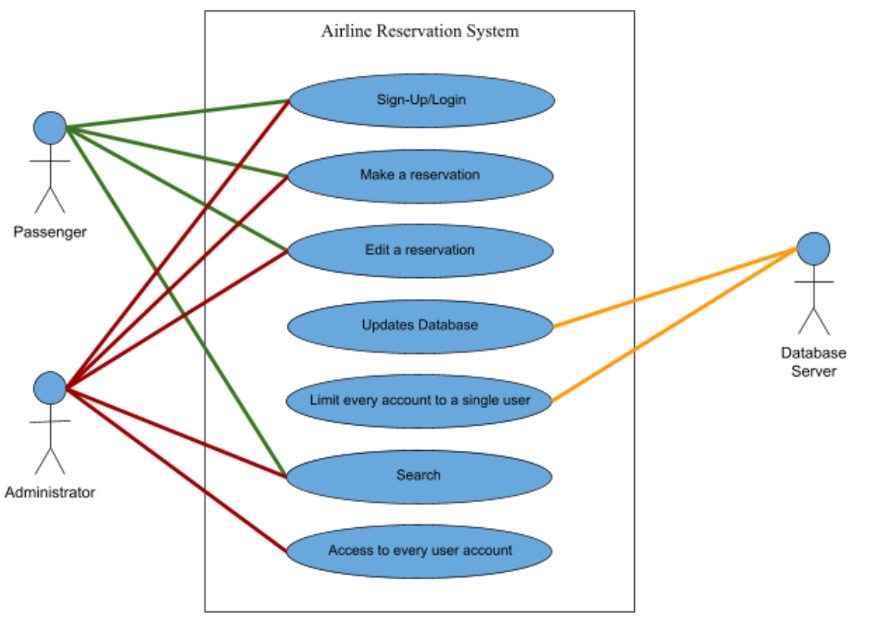

# casestudy-AirlineReservation

## Table of Contents
1) [System Requirements](#systemrequirments)
    * [Use Case](#ri-usecase)
    * [Quality Attributes](#ri-qualattr)
    * [System Constraints](#ri-sysconst)
    * [Architectural Concerns](#ri-archconc)

2) [Iteration 1 - Establishing an Overall System Structure](#iteration1)
    * [Step 2 - Establish Iteration Goals by Selecting Drivers](#i1-step2)
    * [Step 3 - Choose One or More Elements of the System to Refine](#i1-step3)
    * [Step 4 - Choose One or More Design Concepts That Satisfy the Selected Drivers](#i1-step4)
    * [Step 5 - Instantiate Architectural Elements, Allocate Responsibilities](#i1-step5)
    * [Step 6 - Sketch Views and Review Design Decisions](#i1-step6)
    * [Step 7 - Perform Analysis of Current Design and Review Iteration](#i1-step7)

3) [Iteration 2 - Identifying Structures to Support Primary Functionality](#iteration2)
    * [Step 2 - Establish Iteration Goals by Selecting Drivers](#i2-step2)
    * [Step 3 - Choose One or More Elements of the System to Refine](#i2-step3)
    * [Step 4 - Choose One or More Design Concepts That Satisfy the Selected Drivers](#i2-step4)
    * [Step 5 - Instantiate Architectural Elements, Allocate Responsibilities](#i2-step5)
    * [Step 6 - Sketch Views and Review Design Decisions](#i2-step6)
    * [Step 7 - Perform Analysis of Current Design and Review Iteration](#i2-step7)

4) [Iteration 3 - Addressing Quality Attribute Scenario Driver](#iteration3)
    * [Step 2 - Establish Iteration Goals by Selecting Drivers](#i3-step2)
    * [Step 3 - Choose One or More Elements of the System to Refine](#i3-step3)
    * [Step 4 - Choose One or More Design Concepts That Satisfy the Selected Drivers](#i3-step4)
    * [Step 5 - Instantiate Architectural Elements, Allocate Responsibilities](#i3-step5)
    * [Step 6 - Sketch Views and Review Design Decisions](#i3-step6)
    * [Step 7 - Perform Analysis of Current Design and Review Iteration](#i3-step7)

<!-- ---------------------------------------REVIEW INPUTS--------------------------------------- -->

## System Requirements
<!-- ---------------------------------------REVIEW INPUTS--------------------------------------- -->

Figure 2: Use Case Diagram

 
<table align="center">
<tr>
    <th>Use Case</th>
    <th>Description</th>
</tr>
<tr>
    <td>UC-1: Sign-Up / Login</td>
    <td>A user or administrator registers/logs into the system through the sign-up/login screen.</td>
</tr>
<tr>
    <td>UC-2: Make a reservation</td>
    <td>A user makes a flight reservation, selecting the times, dates, passenger seats, travel class, destination and type of flight ticket.</td>
</tr>
<tr>
    <td>UC-3: Edit a reservation</td>
    <td>A user edits a reservation under their account. An admin edits a user's reservation.</td>
</tr>
<tr>
    <td>UC-4: Updates database</td>
    <td>Airline server updates the database for every user activity and every information that is entered.</td>
</tr>
<tr>
    <td>UC-5: Limit every account to a single user</td>
    <td>Airline server limits the user from registering the same email.</td>
</tr>
<tr>
    <td>UC-6: Search</td>
    <td>A user or admin uses the search bar with a filter to search for destinations or airlines.</td>
</tr>
<tr>
    <td>UC-7: Access to every user account</td>
    <td>An admin opens a user's account.</td>
</tr>
</table>

Table 1: Use Cases

 

<table align="center"> 
<tr>
    <th>ID</th>
    <th>Quality Attribute</th>
    <th>Scenario</th>
    <th>Associated Use Case</th>
</tr>
<tr>
    <td>QA-1</td>
    <td>Accessibility</td>
    <td>The website is user-friendly and accessible. The UI allows any user to navigate the website easily and quickly make reservations.</td>
    <td>UC-1, UC-3, UC-4, UC-6 & UC-7</td>
</tr>
<tr>
    <td>QA-2</td>
    <td>Security</td>
    <td>User logs into the system and makes changes to their account. The system has all changes documented, timed and also displays to the user.</td>
    <td>UC-5</td>
</tr>
<tr>
    <td>QA-3</td>
    <td>Compatibility</td>
    <td>User decides to use an Android device to make flight reservations and it is still functional as it is compatible with the device.</td>
    <td>ALL</td>
</tr>
<tr>
    <td>QA-4</td>
    <td>Availability</td>
    <td>There is downtime in the regular operation of the system. The system is backed up and running in less than a minute.</td>
    <td>ALL</td>
</tr>
<tr>
    <td>QA-5</td>
    <td>Performance</td>
    <td>All services are 100% functional at all times.</td>
    <td>ALL</td>
</tr>
</table>

Table 2: Quality Attributes

 

<table align="center">
<tr>
    <th>ID</th>
    <th>Constraint</th>
</tr>
<tr>
    <td>CON-1</td>    
    <td>Accommodate for multiple users must be able to book a reservation / use the system simultaneously, automatically storing each sessions in the database</td>    
</tr>
<tr>
    <td>CON-2</td>    
    <td>Compatibility with desktop operating system (Windows, MacOS, Linux)</td>    
</tr>
<tr>
    <td>CON-3</td>    
    <td>Future support for mobile operating system (iOS, Android)Future support for mobile operating system (iOS, Android)</td>    
</tr>
<tr>
    <td>CON-4</td>    
    <td>System must respond quickly to request of information from database / servers. (transitions between forms, filtering of available flights, etc.)</td>    
</tr>
<tr>
    <td>CON-5</td>    
    <td>Network connections between user and servers should be consistent and reliable</td>    
</tr>
<tr>
    <td>CON-6</td>    
    <td>System must always be up to date with flight details (available flights, # of available seats, time of arrival/departure, etc.)</td>    
</tr>
</table>

Table 3: System Constraints

 

<table align="center">
<tr>
    <th>ID</th>
    <th>Concern</th>
</tr>
<tr>
    <td>CRN-1</td>
    <td>Establishing an overall system structure.</td>
</tr>
<tr>
    <td>CRN-2</td>
    <td>Leverage the team's knowledge about JavaScript Frameworks and Databases.</td>
</tr>
<tr>
    <td>CRN-3</td>
    <td>Allocate work to members of the development team.</td>
</tr>
</table>

Table 4: Architectural Concerns

 

<!-- ---------------------------------------ITERATION 1--------------------------------------- -->

## Iteration 1 - Establishing an Overall System Structure
<!-- ---------------------------------------ITERATION 1--------------------------------------- -->

### Step 2 : Establish Iteration Goals by Selecting Drivers

### Step 3: Choose One or More Elements of the System to Refine

### Step 4: Choose One or More Design Concepts That Satisfy the Selected Drivers

### Step 5: Instantiate Architectural Elements, Allocate Responsibilities

### Step 6: Sketch Views and Review Design Decisions

### Step 7: Perform Analysis of Current Design and Review Iteration

<!-- ---------------------------------------ITERATION 2--------------------------------------- -->

## Iteration 2 - Identifying Structures to Support Primary Functionality
<!-- ---------------------------------------ITERATION 2--------------------------------------- -->

### Step 2 : Establish Iteration Goals by Selecting Drivers

### Step 3: Choose One or More Elements of the System to Refine

### Step 4: Choose One or More Design Concepts That Satisfy the Selected Drivers

### Step 5: Instantiate Architectural Elements, Allocate Responsibilities

### Step 6: Sketch Views and Review Design Decisions

### Step 7: Perform Analysis of Current Design and Review Iteration

<!-- ---------------------------------------ITERATION 3--------------------------------------- -->

## Iteration 3 - Addressing Quality Attribute Scenario Driver
<!-- ---------------------------------------ITERATION 3--------------------------------------- -->

### Step 2 : Establish Iteration Goals by Selecting Drivers

### Step 3: Choose One or More Elements of the System to Refine

### Step 4: Choose One or More Design Concepts That Satisfy the Selected Drivers

### Step 5: Instantiate Architectural Elements, Allocate Responsibilities

### Step 6: Sketch Views and Review Design Decisions

### Step 7: Perform Analysis of Current Design and Review Iteration